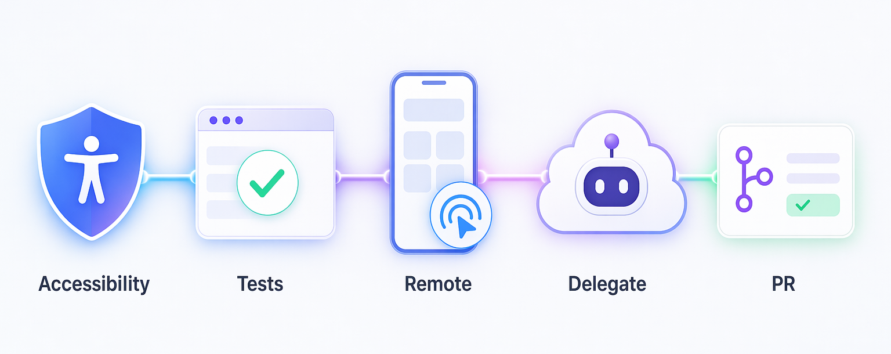
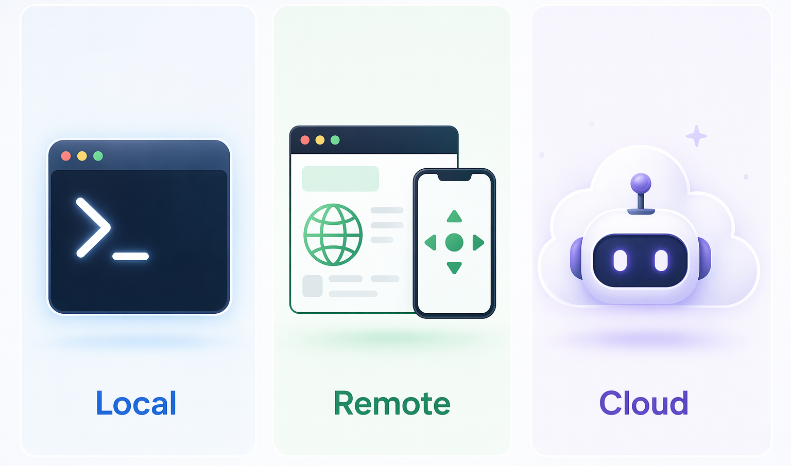
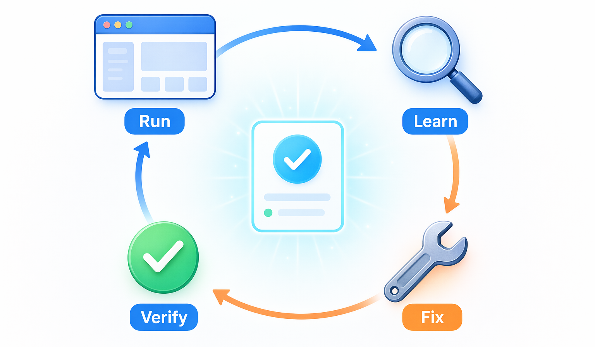
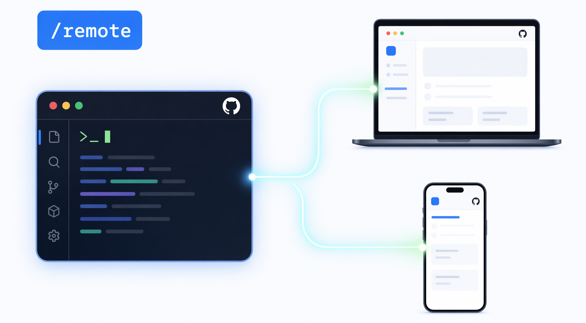
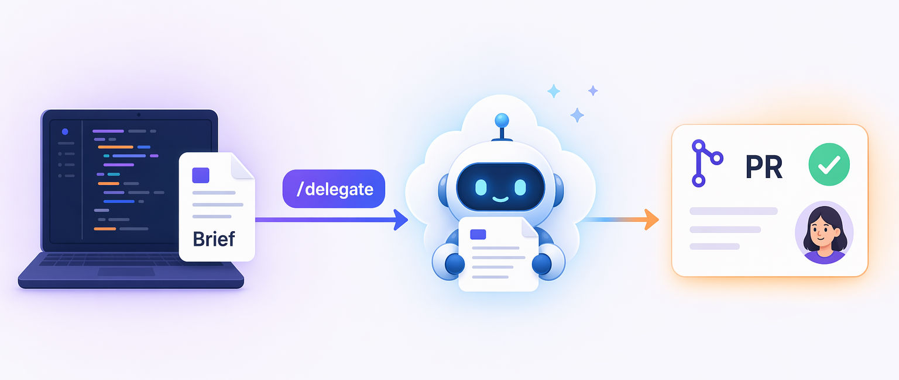

# Section 3: Enhancing the test suite with remote control and delegation

| [← Previous: Building an AI infrastructure][previous-lesson] | [Next: Shaping Copilot CLI's lifecycle with hooks →][next-lesson] |
|:--|--:|

Section 2 made AssetTrack more accessible. Now you need proof that lasts longer than one manual click-through. The next time someone touches the form, navigation, or dashboard, the test suite should raise a clear signal if something breaks.

Your first job is to make that signal real. You'll ask Copilot CLI to scaffold a small Playwright suite, then treat the first failures as evidence instead of noise. Some failures will point to test setup. Some will expose real accessibility gaps. Your job is to tell the difference and make the smallest responsible fix.

Then you'll stretch the workflow beyond one terminal. `/remote` lets you steer the active CLI session from GitHub.com or GitHub Mobile, while `/delegate` sends the larger test backfill to Copilot cloud agent. The pattern is simple: test the fragile path, read the result, fix only what the evidence supports, and give agents enough context that their pull requests are reviewable.



## What you will learn

In this lesson, you will learn:

- how to decide which test work belongs in your local session and which work is safe to delegate.
- how `/remote` lets you steer an active Copilot CLI session from GitHub.com or GitHub Mobile.
- how `/delegate` hands a scoped task to Copilot cloud agent.
- how to use test output to guide small, targeted improvements to the app.
- how to write a useful delegation brief.
- how to review an agent-created pull request before merging it.

## Scenario

> [!NOTE]
> Start from your own AssetTrack repository, with the Section 2 AI infrastructure committed.

If you're jumping directly to this section, make sure you've gone through the [prerequisites][prerequisites] and created your AssetTrack repository first. Then apply the Section 2 catch-up assets from this course repository:

```bash
bash assets/03/section-02-catchup/scripts/apply-section-02-catchup.sh /path/to/your/AssetTrack
```

```powershell
pwsh -File assets/03/section-02-catchup/scripts/apply-section-02-catchup.ps1 -TargetRepo C:\path\to\your\AssetTrack
```

The catch-up assets live in `assets/03/section-02-catchup/` and add the Section 2 instructions, templates, `accessibility-updater` agent, and `make-repo-contribution` skill that this section expects.

You're still working on AssetTrack, Contoso Industries' internal asset-tracking app. The app has a few backend smoke tests, but the UI has no browser test coverage yet. That leaves the team guessing when accessibility changes are made.

Playwright lets you test the app the way a person uses it: load a page, find controls by label, tab through links, and confirm the right content appears. Copilot CLI can help you get the first tests in place, but you still need to make the calls a developer would make. Is the test wrong? Is the app wrong? Is the environment broken?

Once the first pass is working, the rest of the test backfill is ready to delegate. It has concrete files, concrete commands, and a pull request you can review.

## Tech topics

This section covers:

- `/remote`, which gives you remote control of the Copilot CLI session already running in your terminal or codespace.
- `/delegate`, which hands scoped work to Copilot cloud agent.
- Test-guided agent work: create a test, read the failure, make a narrow fix, then rerun the command.

## Choosing the right place for the work

Not every task belongs in the same agent session. Some work needs you in the loop. Some work is mostly mechanical once the instructions are specific.

| Surface | Where work happens | Use it for | Be careful about |
|---|---|---|---|
| Local Copilot CLI session | Your terminal or codespace | Exploration, debugging, reviewing diffs, making judgment calls | You approve tool calls and keep the session running |
| `/remote` | The same active CLI session, controlled from GitHub.com or GitHub Mobile | Watching longer commands, approving prompts while away, checking progress from another device | The original machine or codespace must stay online |
| `/delegate` | Copilot cloud agent on GitHub | Test backfills and other scoped work with commands that prove success | Uncommitted local changes may not be available to the cloud agent |



> [!IMPORTANT]
> `/remote` does not move the work to a hosted runner. It gives you remote control of the session that is already running. Use `/delegate` when you want Copilot cloud agent to work on GitHub in the background.

## Exercise: Start the Playwright test suite locally

In this exercise, you'll ask Copilot CLI to add the first Playwright tests for the AssetTrack web UI. Keep the first pass small. The point is to get a real test harness running, then use the results to validate the accessibility work from Section 2.



### Phase 1: Confirm the app and environment

1. Open the AssetTrack repository you created from the `GeekTrainer/legacy-app` template in Section 0 in a codespace.
2. Open a terminal with <kbd>Ctrl</kbd> + <kbd>`</kbd>.
3. Confirm you are working in the codespace or devcontainer for your AssetTrack repository. Section 0 set this up as the course path. AssetTrack needs Node, .NET, Python, Java, and Maven. The devcontainer installs those tools for you. If you run locally outside the devcontainer, use the setup guidance in the `legacy-app` README before continuing. Also confirm `origin` points to your writable AssetTrack repository, not the upstream `GeekTrainer/legacy-app` template repository:

    ```bash
    git remote -v
    ```

    The fetch and push URLs should point to your AssetTrack repository. If they point to `GeekTrainer/legacy-app`, stop and open your repository from Section 0 instead, or add your writable repository as the push target before continuing.

4. Confirm dependencies are installed. The devcontainer normally runs `npm install && npm run install:all` when it is created. If you see missing package errors, run:

    ```bash
    npm install
    npm run install:all
    ```

5. Start the app from the repository root:

    ```bash
    npm run dev
    ```

6. Wait for the services to start, then open the web app:

    ```text
    http://localhost:4321
    ```

    You should see the AssetTrack web UI before continuing.

> [!NOTE]
> In Codespaces, use the forwarded port URL for port 4321 if `http://localhost:4321` does not open from your browser. You can find it in the Ports tab. If you are using a local devcontainer outside Codespaces, make sure your devcontainer tool or VS Code forwards port 4321 to the host before relying on a browser check. If browser forwarding is unavailable, run `curl -I http://localhost:4321` inside the devcontainer and confirm it returns `HTTP/1.1 200 OK` before continuing.

7. Stop the dev server with <kbd>Ctrl</kbd> + <kbd>C</kbd> before continuing.

### Phase 2: Inspect the current test setup

1. Start Copilot CLI from the repository root:

    ```bash
    copilot
    ```

2. If prompted to trust the folder, approve access for the session.
3. Ask Copilot to inspect the current test setup:

    ```text
    Inspect this repository's current test setup. Summarize what test frameworks already exist, which services have tests, which services are missing tests, and where a Playwright browser test suite should live. Do not edit files yet.
    ```

4. Review the response. Copilot should find:
    - xUnit tests under `services/assets-svc/Tests/`.
    - a Spring Boot context test under `services/workforce-svc/src/test/`.
    - an intentionally empty `services/reporting-svc/tests/` folder.
    - no Playwright setup for `services/web` yet.
    - a good reason to put the Playwright config at the repo root, since the tests need to start the full app with `npm run dev`.

If Copilot misses the empty reporting tests folder or suggests putting Playwright only inside `services/web`, ask it to inspect the repository scripts and service folders again before editing files.

### Phase 3: Scaffold the Playwright foundation

1. Ask Copilot to scaffold Playwright:

    ```text
    Add a minimal Playwright browser test setup for the AssetTrack web UI.

    Requirements:
    - Put the Playwright config at the repository root as playwright.config.ts.
    - Put tests under tests/playwright/.
    - Add npm scripts at the repository root for test:e2e and test:e2e:ui.
    - Use the existing npm run dev command as the Playwright webServer command.
    - Target http://localhost:4321 as the base URL.
    - Use Chromium only for now so the course exercise stays fast.
    - Do not change production application code in this step.
    - After editing, run the install or test command needed to verify the setup. A normal first setup may add @playwright/test and run npx playwright install chromium. In Codespaces, npx playwright install --with-deps chromium may be needed.
    ```

2. Review the permission prompts before approving them. A reasonable first result is:

    ```text
    playwright.config.ts
    tests/playwright/accessibility.spec.ts
    package.json
    package-lock.json
    ```

3. Before running the whole app, ask Copilot to check that Playwright can see the tests:

    ```text
    Run npx playwright test --list and confirm the accessibility tests are discovered. If the command fails, fix only the Playwright setup.
    ```

    The result should name `npx playwright test --list`, report at least one test under `tests/playwright/`, and avoid application source changes. If the command finds zero tests, stay in setup mode and fix the Playwright config or test file path before continuing.

### Phase 4: Add focused accessibility coverage

1. Ask Copilot to add focused accessibility tests:

    ```text
    Create the first Playwright accessibility tests for AssetTrack.

    Cover these user-visible behaviors:
    1. The dashboard has a navigation landmark, a main landmark, and a level-one heading named Dashboard.
    2. The top navigation exposes the active page with aria-current="page" when the user opens Dashboard and Assets.
    3. The new asset form fields can be located by accessible label: Asset tag, Type, Manufacturer, Model, Serial number, Status, Purchase date, Warranty expiry, and Notes.
    4. The assets list filter controls can be located by accessible label: Type, Status, and Search tag / manufacturer / model.
    5. A keyboard user can tab from the page into the navigation and reach the Assets link.

    Keep the tests small and readable. Prefer Playwright role and label locators such as getByRole and getByLabel. Do not use CSS selectors unless there is no accessible alternative.
    ```

> [!NOTE]
> If `getByLabel` fails, read the failure carefully. A visible label is not enough if it is not connected to the input, select, or textarea. That is exactly the kind of issue these tests should catch.

2. Run the Playwright tests:

    ```text
    Run the Playwright tests and summarize the result. If any tests fail, classify each failure as one of: test bug, app accessibility gap, or environment/startup issue. Do not change production code yet.
    ```

3. Review the output. You may see form labels that are not associated with controls, keyboard focus problems, or service startup issues. The summary should include the command run, how many tests were found, the pass/fail count, each failure category, and the next action Copilot recommends.
4. If the test setup is broken, keep the fix limited to the setup:

    ```text
    Fix only the Playwright setup or test code needed to make the tests run reliably. Do not change application source files yet. Keep the scope limited to playwright.config.ts, tests/playwright/**, and package files.
    ```

5. If the failures point to real accessibility gaps, use the custom agent from Section 2 for a narrow follow-up fix. Before switching agents, confirm your AssetTrack repository still has the Section 2 agent files and instructions. If the `accessibility-updater` agent is missing, return to Section 2 to recreate it before continuing, or make a direct narrow fix only if your instructor tells you to proceed without the custom agent. If Copilot does not automatically switch to the right agent, run `/agent`, select `accessibility-updater`, and then send the prompt:

    ```text
    Fix only the accessibility gaps identified by the failing Playwright tests. Keep the changes narrow: associate labels with their controls, add missing landmark labels if needed, and avoid visual redesigns. After the fix, rerun npm run test:e2e and summarize the before/after result.
    ```

6. Review the diff. You want either a passing validation result or a small app change backed by a test result. Do not commit yet. You'll create the handoff branch and commit the local work after you add the delegation brief.

    You'll use these commit messages later:

    ```text
    test: add Playwright accessibility foundation
    fix: address accessibility gaps found by Playwright
    ```

> [!IMPORTANT]
> A failing test can be a good result if it points to a real gap. Do not stop at the report, though. The real workflow is test, diagnose, fix narrowly, rerun, then commit the evidence.

## Remote control with `/remote`

Remote control lets you connect to a running Copilot CLI session from a browser or GitHub Mobile. You can view output, respond to permission prompts, and keep working without sitting in front of the terminal.

Remote control and delegation solve different problems:

- Remote control steers the same active CLI session.
- Delegation starts asynchronous work with Copilot cloud agent.

Remote control is handy when a task takes a while, such as installing Playwright browsers, starting several services, or waiting for browser tests to finish. Remote control must be enabled for your GitHub account and organization before `/remote on` can create a GitHub.com session link.



## Exercise: Use `/remote` to steer the session from GitHub

In this exercise, you'll enable remote control for the running Copilot CLI session and use the remote UI to run the Playwright suite again. This is the kind of thing you do when a validation command is running in your codespace and you want to approve the next step from another tab or device.

1. In the same Copilot CLI session, enter:

    ```text
    /remote on
    ```

2. If remote control is enabled for your account and organization, Copilot CLI displays a link to open the session on GitHub.com. Open the link. You should see the same conversation that is visible in your terminal.
3. If Copilot reports that remote controlled sessions are not enabled, your organization has disabled this feature. Record that limitation, skip the rest of this exercise, and continue with the delegation exercise.
4. Sign in with the same GitHub account that started the CLI session.
5. Confirm the remote page shows the current prompt history and accepts a new message.
6. From the remote session UI, send this prompt:

    ```text
    Run the Playwright suite again. If the app needs to start first, use the existing Playwright webServer configuration. Summarize any failures as test bug, app accessibility gap, or environment/startup issue.
    ```

7. Watch the session from the browser or mobile app. If Copilot asks for permission to run commands, respond from the remote UI.
8. Optional: if you expect to step away while the machine or codespace keeps working, keep the session marked busy:

    ```text
    /keep-alive busy
    ```

> [!TIP]
> Use `/keep-alive busy` only when your environment might idle during longer commands. If your Copilot CLI version does not recognize `/keep-alive`, keep the codespace or machine active using your instructor's environment guidance. Remote control lets you steer the session, but it cannot keep a stopped terminal session alive.

9. When you are done testing remote control, enter:

    ```text
    /remote off
    ```

You can also enter `/remote` without an argument to check the current status.

> [!NOTE]
> If Copilot reports that remote sessions are disabled because the current folder is not a GitHub repository, confirm you started Copilot from the root of your AssetTrack repository. Remote control also does not fix missing local dependencies. If the original environment cannot install Playwright browsers or start the app, fix that environment or switch to the course codespace.

## Authoring delegation prompts that work

The next exercise uses `/delegate`, which sends work to Copilot cloud agent. The cloud agent works on GitHub, creates a branch, makes commits, and opens a draft pull request.

Now the work moves from local help to team workflow. You define a test backlog item, send it to the cloud agent, and review the PR like you would review a teammate's work.



Good delegation prompts include:

- the exact files or folders in scope.
- commands the agent should run.
- things the agent should not touch.
- what the PR description should include.
- what to do if a real bug blocks the test.

A weak prompt is vague:

```text
/delegate improve the tests
```

A better prompt gives the agent a job it can finish:

```text
/delegate Add Playwright tests under tests/playwright for the AssetTrack navigation and asset form accessibility behaviors described in docs/delegations/test-backfill.md. Do not change production code. Open a draft PR with test evidence.
```

The brief should live in the repo so the prompt can point to a real artifact and reviewers can see what the agent was asked to do.

## Exercise: Use `/delegate` to offload the test backfill

In this exercise, you'll create a delegation brief and send it to Copilot cloud agent. The primary job is to expand the Playwright accessibility coverage you started locally. Since the cloud agent will already be working in the test suite, you'll also ask it to backfill a few unit tests for the .NET asset service and the Python reporting service. That gives the agent a bounded backlog item with commands that prove whether it worked.

This exercise creates external GitHub state: a branch, commits, a push to your AssetTrack repository, a cloud agent task, and a draft pull request. Before you start, make sure `git remote -v` shows a writable repository remote and that you are ready to create those artifacts in your repository. If your clone points only to `GeekTrainer/legacy-app`, fix the remote before committing or delegating.

1. Ask Copilot CLI to create a delegation brief:

    ```text
    Create docs/delegations/test-backfill.md with a delegation brief for Copilot cloud agent.

    The brief should make the priorities clear:

    Primary goal:
    - Expand the Playwright accessibility coverage started locally for the AssetTrack UI.
    - Keep using role and label locators where possible.
    - Cover the dashboard, navigation, asset list filters, and new asset form behaviors introduced earlier in this section.

    Secondary goal:
    - Add xUnit backfill coverage for services/assets-svc covering create, read, update, delete, search, stats-by-status, and not-found edge cases.
    - Add pytest backfill coverage for services/reporting-svc covering warranty-expiring reports, utilization reports, and CSV import behavior.

    Constraints:
    - Do not change production application code.
    - Do not add new backend framework dependencies unless required for the test framework already implied by the service.
    - Prefer isolated test data and temporary SQLite databases.
    - If a real production bug blocks a test, document it in the PR and add a skipped or clearly named failing test only if the course instructor approves.
    - Include exact commands run in the PR description.
    ```

2. Review the generated brief before continuing. It should be specific enough for the cloud agent to act without asking you many follow-up questions.
3. Make sure the cloud agent can see the state you want it to work from. First, ask Copilot for a read-only review of the working tree:

    ```text
    Show me the current git status and summarize the files changed for the Playwright setup, accessibility follow-up if any, and delegation brief. Do not commit or push yet.
    ```

4. Review the output before approving any write operation. Pay special attention to `package-lock.json`. It should only reflect the packages needed for this test setup. The files you expect to see are usually:
    - `playwright.config.ts`
    - `tests/playwright/accessibility.spec.ts`
    - `package.json`
    - `package-lock.json`
    - `docs/delegations/test-backfill.md`
    - any narrow Astro accessibility fix, only if the tests proved one was needed
5. Before committing, keep generated Playwright artifacts out of the handoff. Ask Copilot to clean or ignore them:

    ```text
    Remove generated Playwright run artifacts from the working tree before delegation. Do not delete source tests or config. If test-results/ or playwright-report/ exists, remove those generated folders or add the right ignore rules, then show git status again.
    ```

    The status should not include generated files such as `test-results/` or `playwright-report/`.
6. After the diff summary looks right, ask Copilot to create the branch, commit, and push:

    ```text
    Create a branch named test-suite-foundation. Commit the Playwright foundation with the message "test: add Playwright accessibility foundation". If there is a narrow accessibility fix, use a second commit with the message "fix: address accessibility gaps found by Playwright". Commit docs/delegations/test-backfill.md with the message "docs: add test backfill delegation brief". Then push the branch to my AssetTrack repository.
    ```

> [!WARNING]
> Do not delegate from a dirty working tree unless you understand what Copilot is checkpointing. The cloud agent works from GitHub state, not from hidden local files.

7. Confirm the pushed branch contains the delegation brief before using `/delegate`:

    ```text
    Verify that docs/delegations/test-backfill.md exists on the pushed test-suite-foundation branch in my AssetTrack repository. Use GitHub or gh to check the remote branch, not just the local working tree. Do not delegate until the brief is visible on GitHub.
    ```

    If the brief is missing from the remote branch, push the missing commit before continuing.
8. Use `/delegate` with the brief. Include the core brief details inline too, so the cloud agent still has enough context if it starts from a different branch ref:

    ```text
    /delegate Use the pushed test-suite-foundation branch and docs/delegations/test-backfill.md as the source of truth. If the branch context does not include that file, use this brief summary: primary goal, expand Playwright accessibility coverage under tests/playwright using role and label locators for dashboard, navigation, asset list filters, and new asset form behaviors; secondary goal, add xUnit coverage for services/assets-svc covering create, read, update, delete, search, stats-by-status, and not-found edge cases, and add pytest coverage for services/reporting-svc covering warranty-expiring reports, utilization reports, and CSV import behavior. Keep production application code unchanged. If production behavior blocks a test, document the gap in the PR instead of fixing it. Open a draft pull request with the title "Add test suite backfill" and include the commands you ran plus their results in the PR description.
    ```

9. Copilot may ask to create a checkpoint commit or confirm the target repository. Review the prompt and approve only if it points to your AssetTrack repository. If Copilot still reports uncommitted generated artifacts, cancel the delegation, clean the working tree, and try again.
10. Once the cloud agent starts, Copilot CLI provides links to the agent session and the draft pull request when it is created.
    If `/delegate` reports that Copilot cloud agent is unavailable, disabled, or blocked by permissions, record that limitation and keep the `test-suite-foundation` branch as the handoff artifact. You can still use the delegation brief later when cloud agent access is available.
11. While the cloud agent works, continue reviewing the local Playwright results:

    ```text
    Based on the current Playwright results, identify which ones are likely real accessibility gaps and which ones are test setup issues. Create a short note I can use during PR review.
    ```

12. When the PR is ready, review it like any other PR. You can use GitHub.com, or ask Copilot CLI to help inspect it:

    ```text
    Open the draft PR created by the delegated test backfill. Summarize the changed files, the tests added, the commands reported by the agent, and any production code changes.
    ```

13. Review the PR against this checklist:
    - The PR targets your AssetTrack repository and the expected branch.
    - The PR description references `docs/delegations/test-backfill.md`.
    - Playwright tests live under `tests/playwright/`.
    - Asset service tests live under `services/assets-svc/Tests/`.
    - Reporting service tests live under `services/reporting-svc/tests/`.
    - The agent did not change production code unless it clearly explained why.
    - The PR includes test evidence, including commands and results.
    - Any skipped or failing tests are justified and easy to find.
14. If the PR is blocked because it cannot find the delegation brief, comment with the branch and file location:

    ```text
    Please revise using the pushed test-suite-foundation branch as context. The source-of-truth brief is at docs/delegations/test-backfill.md on that branch. Use the brief to add the Playwright, xUnit, and pytest backfill, keep production code unchanged, and update the PR description with command output.
    ```

15. If the PR needs changes, comment with specific feedback:

    ```text
    Please revise the Playwright tests to use role and label locators instead of CSS selectors. Keep production code unchanged. Update the PR description with the new test command output.
    ```

16. Before merging a PR that includes the reporting service test backfill, make sure the required test tools are available. For the reporting service, the dev dependencies include `pytest`. If `pytest` is missing, install the service with its dev extras from the repository root:

    ```bash
    pip install -e "services/reporting-svc[dev]"
    ```

17. Run or verify the main commands after the delegated PR has added the test backfill:

    ```bash
    npm run test:e2e
    dotnet test services/assets-svc/Tests/AssetsService.Tests.csproj
    cd services/reporting-svc && pytest
    ```

    If the delegated PR is still blocked or has not added reporting tests yet, do not treat `pytest` collecting zero tests as a final validation failure. Record it as a sign that the delegated backfill is incomplete and keep the PR in draft.

18. Depending on your environment, you may also run:

    ```bash
    npm --prefix services/web run build
    ```

At the end of this section, your AssetTrack repository should contain the Playwright foundation, a validation result for the Section 2 accessibility work, any narrow follow-up accessibility fix that was needed, and a delegation brief. The delegated PR should primarily expand Playwright accessibility coverage, with xUnit and pytest backfill included as secondary work. The exact test file names matter less than the behaviors covered and the commands that prove they work.

## Summary

You used Copilot CLI in three different ways in this section. First, you worked locally to create the Playwright foundation and validate the accessibility work. Then you tried `/remote` to steer that same session from GitHub. Finally, you used `/delegate` to send a scoped test backfill to Copilot cloud agent.

In this lesson, you learned:

- how to start a Playwright suite for AssetTrack.
- how to read early browser test failures without guessing.
- how to turn a failing accessibility test into a narrow product improvement when the evidence calls for it.
- how `/remote` can give you remote control of an active CLI session.
- how `/delegate` sends scoped work to Copilot cloud agent.
- how to write and review a useful delegation brief.

Next, you'll shape Copilot CLI's lifecycle with hooks so tests, builds, and lint checks run automatically as Copilot edits the project in [Section 4][next-lesson].

## Resources

- [Steer a Copilot CLI session remotely][remote-docs]
- [Delegate tasks to Copilot cloud agent][delegate-docs]
- [About Copilot cloud agent][cloud-agent]
- [Playwright getting started][playwright]
- [Playwright locators][playwright-locators]
- [Accessible name and description computation][accessible-name]

---

| [← Previous: Building an AI infrastructure][previous-lesson] | [Next: Shaping Copilot CLI's lifecycle with hooks →][next-lesson] |
|:--|--:|

[previous-lesson]: ./02-building-ai-infrastructure.md
[next-lesson]: ./04-lifecycle-hooks.md
[prerequisites]: ./00-prerequisites.md
[remote-docs]: https://docs.github.com/copilot/how-tos/copilot-cli/use-copilot-cli/steer-remotely
[delegate-docs]: https://docs.github.com/copilot/how-tos/copilot-cli/use-copilot-cli/delegate-tasks-to-cca
[cloud-agent]: https://docs.github.com/copilot/concepts/agents/cloud-agent/about-cloud-agent
[playwright]: https://playwright.dev/docs/intro
[playwright-locators]: https://playwright.dev/docs/locators
[accessible-name]: https://www.w3.org/TR/accname-1.2/
